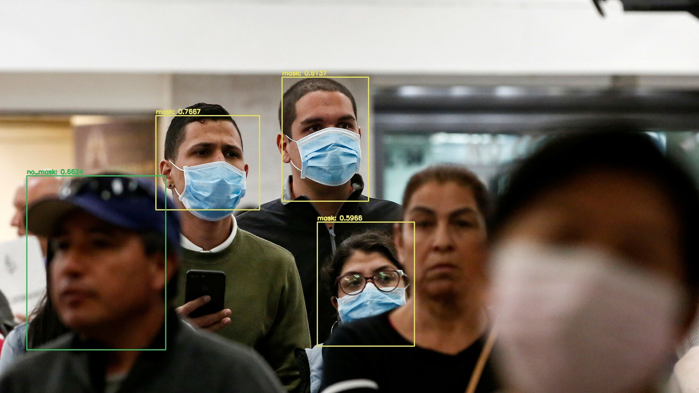

# Detección de mascarilla en tiempo real

Este es un trabajo en conjunto con @fbahamonde, donde hemos entrenado un modelos para detectar si una persona está usando o no una mascarilla. Para esto decidimos enfocarnos en que el modelo funcionara en tiempo real en un dispositivo con bajos recursos, cómo una una laptop o una raspberry. 

En términos generales, el trabajo consistió en la creación de un dataset de +2.500 imágenes, a las cuales aplicamos técnicas de data augmentation para terminar con un dataset de +50.000 imágenes y luego de muchas iteraciones terminamos con un tiny-yolo más que aceptable para la detección de mascarillas en tiempo real!




### Fuentes importantes de información que utilizamos para este proyecto

Las siguientes fuentes de información las utilizamos como referencia para realizar este trabajo:

* Cómo correr YOLO con OpenCV? </br>
https://www.pyimagesearch.com/2018/11/12/yolo-object-detection-with-opencv/

* Herramienta para dibujar bounding boxes en las imagenes con el formato de YOLO</br>
https://github.com/developer0hye/Yolo_Label

* Aumentar datos</br>
https://github.com/aleju/imgaug

* Cómo entrenar YOLO en objectos custom?</br>
https://github.com/AlexeyAB/darknet/

### FPS logrados:
* 5FPS en un Intel Core i3 4005U
* 12.5FPS en un Intel Core i5 8210Y


### Cómo usarlo?

* Primero hay que instalar las dependencias necesarias para ejecutar el código:

#### Para Windows

```
python -m venv virtual_env
virtual_env/Scripts/activate
cd virtual_env/Scripts/
activate
cd ../../
pip install -r requirements.txt
```

#### Para Linux

```
python -m venv virtual_env
source virtual_env/bin/activate
pip install -r requirements.txt
```

* Para ejecutar el modelo contra una imagen debes usar el siguiente comando, donde --image corresponde al path de la imagen de entrada

```
python yolo_image.py --yolo tiny-yolo-mask-detection --image images/image1.jpg
```

* Para ejecutar el modelo contra un video debes usar el siguiente comando, donde --video corresponde al path del video de entrada

```
python yolo_video.py --yolo tiny-yolo-mask-detection --video videos/video1.mp4
```

* Para ejecutar el modelo en tiempo real en la webcam usa el siguiente comando

```
python yolo_streaming.py --yolo tiny-yolo-mask-detection
```