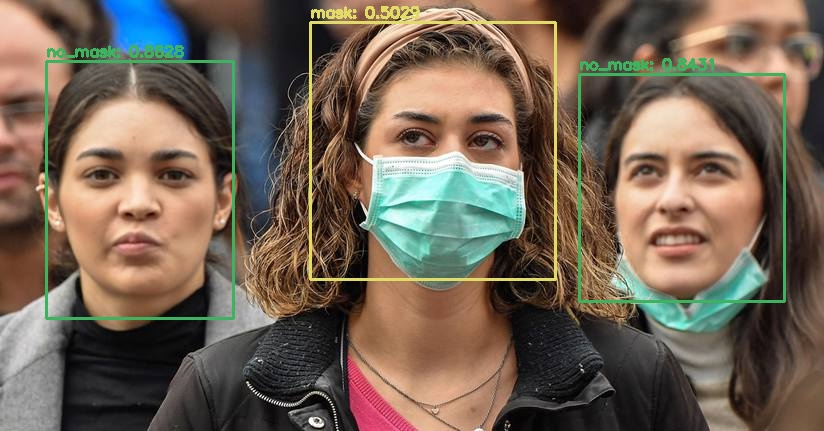

# Detección de mascarilla en tiempo real

Tiny Yolo



### Fuentes importantes de información que utilizamos para este proyecto

* Cómo correr YOLO con OpenCV? </br>
https://www.pyimagesearch.com/2018/11/12/yolo-object-detection-with-opencv/

* Cómo entrenar YOLO en objectos custom?</br>
https://github.com/AlexeyAB/darknet/

* Herramienta para dibujar bounding boxes en las imagenes con el formato de YOLO</br>
https://github.com/developer0hye/Yolo_Label

* Web Scraping</br>
Descargamos imágenes de google de personas con/sin mascarilla

* Aumentar datos</br>
https://github.com/aleju/imgaug

### FPS logrados:
* 5FPS en un Intel Core i3 4005U
* 12.5FPS en un Intel Core i5 8210Y


### Cómo usarlo?

* Primero hay que instalar las dependencias necesarias para ejecutar el código (win10)

```
python -m venv virtual_env
cd virtual_env/Scripts/
activate
cd ../../
pip install -r requirements.txt
```

* Para ejecutar el modelo contra una imagen debes usar el siguiente comando, donde --image corresponde al path de la imagen de entrada

```
python yolo_image.py --yolo tiny-yolo-mask-detection --image images/image1.jpg
```

* Para ejecutar el modelo contra un video debes usar el siguiente comando, donde --video corresponde al path del video de entrada

```
python yolo_video.py --yolo tiny-yolo-mask-detection --video videos/video1.mp4
```

* Para ejecutar el modelo en tiempo real en la web cam usa el siguiente comando

```
python yolo_streaming.py --yolo tiny-yolo-mask-detection
```